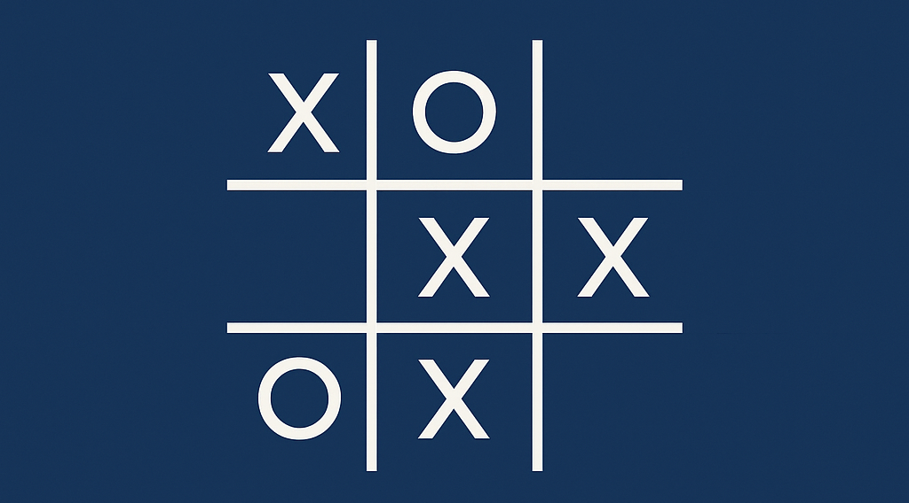

# Jogo da Velha com IA Minimax



Este é um projeto de implementação do clássico jogo da velha (Tic Tac Toe) em C# que utiliza o algoritmo **Minimax** para criar uma Inteligência Artificial (IA) imbatível. O objetivo do projeto é demonstrar conceitos fundamentais de **inteligência artificial** e **teoria dos jogos**, oferecendo uma experiência interativa e educativa.

## História do Algoritmo Minimax

O algoritmo **Minimax** foi desenvolvido na década de 1950 como parte da evolução dos jogos de computador e das primeiras tentativas de construir IA para jogos. Ele é particularmente famoso por sua aplicação em jogos de dois jogadores, onde os dois jogadores têm conhecimento total do estado atual do jogo. O nome "Minimax" vem do objetivo básico do algoritmo: "minimizar" a perda do jogador (Min) e "maximizar" o ganho do jogador (Max), sendo aplicado alternadamente para cada um dos jogadores.

### Origens e Primeiras Aplicações

A origem do algoritmo Minimax está diretamente ligada aos avanços na pesquisa em **inteligência artificial**. O conceito foi formalizado por **John von Neumann**, um matemático e cientista da computação, que desenvolveu a teoria dos jogos. O trabalho de von Neumann com teoria dos jogos e algoritmos de decisão levou à criação de várias estratégias para jogos como xadrez, damas e outros jogos competitivos.

A primeira aplicação do Minimax em um jogo foi feita no campo dos **jogos de tabuleiro**, e ele foi introduzido para ajudar as máquinas a tomarem decisões ótimas em jogos competitivos. O algoritmo foi utilizado pela primeira vez em **jogos como o Xadrez**, onde a IA tenta prever todas as possíveis jogadas e selecionar a melhor jogada com base em uma avaliação dos resultados futuros.

### Evolução e Impacto

O Minimax é um dos primeiros algoritmos de **inteligência artificial** amplamente usados para jogos de dois jogadores. Sua simplicidade e eficácia o tornaram uma base para outros algoritmos mais complexos, como o **Alpha-Beta Pruning**, que otimiza a busca em árvore para melhorar a eficiência do Minimax, evitando explorar ramos da árvore que não precisam ser avaliados.

Apesar de sua criação nas décadas de 1940 e 1950, o Minimax permanece um conceito fundamental no estudo de jogos e IA. Sua aplicação em jogos simples, como o Jogo da Velha (Tic Tac Toe), exemplifica como técnicas de IA podem ser usadas em problemas práticos, tornando-se uma ótima ferramenta para iniciantes entenderem os conceitos de **decisão** e **estratégia** computacional.

## Funcionamento do Algoritmo Minimax

1. **Maximização e Minimização**: O Minimax funciona alternando entre dois jogadores:
   - O jogador "Max" tenta maximizar sua pontuação, ou seja, escolher a melhor jogada para si.
   - O jogador "Min" tenta minimizar a pontuação do adversário, escolhendo a melhor jogada para impedir a vitória do "Max".

2. **Avaliação do Jogo**: O algoritmo avalia o estado atual do jogo utilizando uma função de avaliação, que atribui valores a diferentes resultados:
   - **+1** se o jogador Max (IA) vencer.
   - **-1** se o jogador Min (humano) vencer.
   - **0** em caso de empate.

3. **Recursão**: A cada jogada, o Minimax explora todas as possibilidades futuras de movimento, até que o jogo termine (vitória, derrota ou empate). As jogadas são então avaliadas com base nos resultados finais possíveis, e a IA escolhe a melhor jogada disponível.

## Como Funciona o Jogo

O Jogo da Velha é jogado em um tabuleiro 3x3, onde dois jogadores se alternam para colocar seus símbolos (X e O) nas células. O jogo termina quando um dos jogadores preenche uma linha, coluna ou diagonal com seus símbolos ou quando todas as células do tabuleiro estão preenchidas (empate).

No caso deste projeto, a IA utiliza o algoritmo Minimax para jogar contra o usuário. A IA sempre escolhe a melhor jogada possível, o que a torna imbatível.

## Funcionalidades

- **Modo de Jogo**: Jogo contra a IA.
- **IA Imbatível**: A IA usa o algoritmo Minimax para analisar todas as possibilidades e sempre escolher a melhor jogada.
- **Interface Simples**: Interface de linha de comando (CLI) para jogar.

## Requisitos

- .NET Core ou .NET Framework (C#)
- Qualquer terminal de linha de comando para interagir com o jogo.

## Como Rodar o Projeto

1. Clone o repositório:
   ```bash
   git clone https://github.com/franciscomarcello17/grupo-estudos-voluntario-ia-tictactoe-minimax.git
   ```
2. Navegue até a pasta do projeto:
   ```bash
   cd grupo-estudos-voluntario-ia-tictactoe-minimax
   ```
3. Compile e execute o projeto:
   ```bash
   dotnet run
   ```

4. Jogue o jogo diretamente na linha de comando, seguindo as instruções apresentadas na tela.

## Referências

- **Minimax Algorithm**: [Wikipedia - Minimax Algorithm](https://en.wikipedia.org/wiki/Minimax)
- **Inteligência Artificial - Estruturas e Algoritmos**: [Artificial Intelligence - A Modern Approach](http://aima.cs.berkeley.edu/) (Stuart Russell, Peter Norvig)
